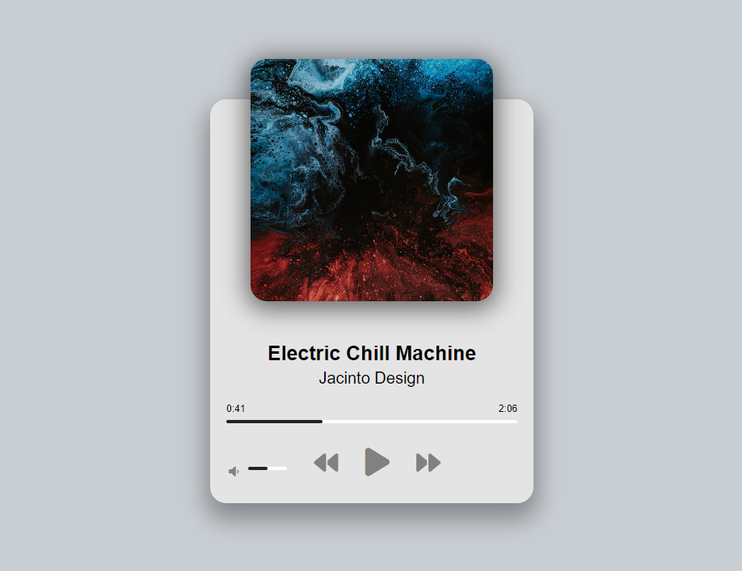

# Music Player application

I made this project for training and to be able to work with different methods and **DOM** properties of the <audio> tag.

The player supports the next features:
+ Click on the progress bar to change the position of the playing song.
+ Click on **previous** or **next** to change the song
+ When the song is changed, the next song auto-plays itself
+ Click on the volume bar to change the volume
+ Click on the mute icon, to mute the volume. If the unmute is pressed, the volume gets back where it was.

